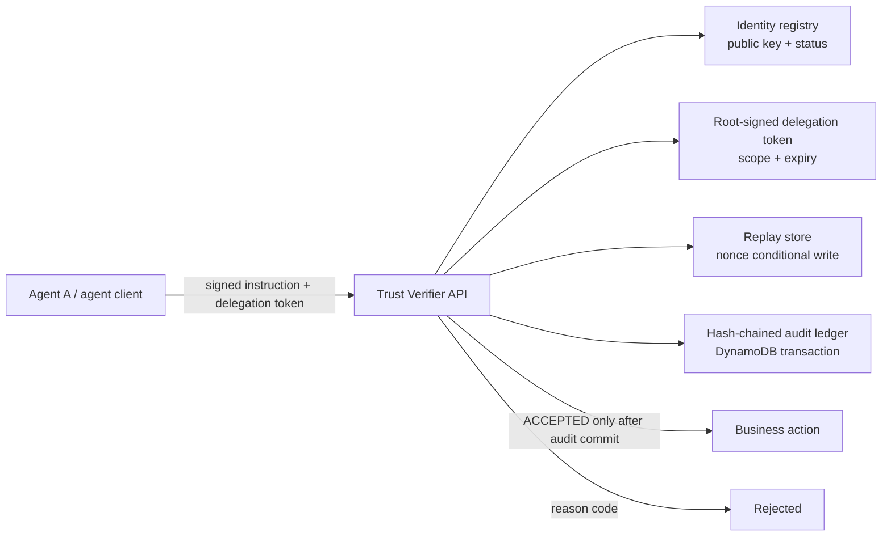

# Agent Trust Verifier

Agent Trust Verifier is a security gate for actions requested by AI agents. Before an action can run, it checks who signed it, whether that agent has been given permission for that specific action, whether the request is fresh and has not been replayed, and whether the decision can be saved in an audit trail. If any check fails—or the audit store cannot be reached—the action is rejected.

**Read first:** [architecture and security invariants](docs/architecture.md) · [Phase 12 security review](docs/security-review.md)

**Live API:** `https://sih25orneb.execute-api.eu-north-1.amazonaws.com`

## Architecture



The FastAPI service runs in AWS Lambda behind API Gateway. DynamoDB stores registered public keys, replay nonces, reputation state, and the tamper-evident audit ledger. The verifier checks the signed envelope in a fixed order and fails closed if any trusted dependency cannot complete its part of the decision.

## Dashboard

The dashboard is static HTML, CSS, and JavaScript. It is already configured to call the live API above.

```bash
python -m http.server 8081 --directory dashboard
```

Open [http://localhost:8081](http://localhost:8081). The dashboard polls health and live audit state, sends a valid instruction, runs selected red-team cases, revokes Agent A, runs concurrent requests, and supports manual prompt testing. Dashboard demo controls require the deployed `ALLOW_TEST_BOOTSTRAP=1` setting.

The API permits the dashboard origin through `DASHBOARD_ALLOWED_ORIGINS`; the demo deployment defaults it to `*`. Set this to the dashboard’s exact origin when hosting it publicly.

## Run locally

Use Python 3.12 for the deployment-compatible runtime.

```bash
python -m venv .venv
# macOS/Linux
source .venv/bin/activate
# Windows PowerShell
# .\.venv\Scripts\Activate.ps1

python -m pip install -r requirements.txt
uvicorn api.main:app --reload
```

For local demo controls, enable the gated bootstrap route before starting Uvicorn:

```bash
# macOS/Linux
export ALLOW_TEST_BOOTSTRAP=1
# Windows PowerShell
# $env:ALLOW_TEST_BOOTSTRAP = "1"
```

To use the optional Gemini narration/manual-prompt flow, provide `GEMINI_API_KEY` in your environment. Never commit it.

## Test suite

```bash
python -m pytest -q
```

The suite covers cryptographic signing, delegation, replay prevention, revocation, API routes, DynamoDB parity, audit-chain integrity, and dashboard control routes.

## Attack suite

Phase 9 provides eight demonstrable attack scenarios: unsigned and forged instructions, post-signature tampering, wrong audience, scope escalation, expired tokens, replay, and agent revocation.

Against the live deployment, with its test bootstrap setting enabled:

```bash
python -m redteam.run_attack_suite \
  --base-url https://sih25orneb.execute-api.eu-north-1.amazonaws.com
```

For a judge-ready, ordered demo sequence:

```bash
bash scripts/full_demo.sh \
  --base-url https://sih25orneb.execute-api.eu-north-1.amazonaws.com
```

## Deployment

The AWS SAM template deploys a Python 3.12 Lambda, API Gateway HTTP API, and four DynamoDB tables. It uses least-privilege DynamoDB permissions, including the transaction permissions needed by the audit chain.

Prerequisites: AWS CLI, AWS SAM CLI, Python 3.12, an AWS account, and a base64-encoded Ed25519 root private key kept outside this repository.

```bash
export ROOT_PRIVATE_KEY_B64="..."
export GEMINI_API_KEY="..."                 # optional
export ALLOW_TEST_BOOTSTRAP=1                 # demo environments only

sam build --template-file infrastructure/template.yaml
sam deploy --guided
```

Use `ALLOW_TEST_BOOTSTRAP=0` for normal deployments. In a production environment, store the root key and Gemini key in AWS Secrets Manager or SSM Parameter Store rather than Lambda environment variables.

## What This Project Does Not Claim

- It does not make an LLM safe, truthful, or immune to prompt injection.
- It does not decide whether an authorized business action is wise, correct, or compliant with every policy.
- It does not replace application authentication, authorization, secret management, monitoring, or human approval where those controls are needed.
- It does not claim production-scale availability, a complete compliance programme, or interoperability with every agent framework.
- It demonstrates a verification boundary: it proves who signed a structured instruction, what scope was delegated, and whether the decision was durably recorded before execution.

## Real-World Context

This project demonstrates a core primitive—verifiable agent identity, scoped delegation, and audit evidence—that is being explored in current IETF Internet-Drafts such as the [Agent Identity Protocol](https://datatracker.ietf.org/doc/draft-aip-agent-identity-protocol/) and the [Delegation Receipt Protocol](https://datatracker.ietf.org/doc/draft-nelson-agent-delegation-receipts/). These are individual drafts, not established standards. Vendors are also building related governance controls: [Okta](https://www.okta.com/content/dam/resources/en_us/datasheets/okta-AI-agents-core.pdf) describes agent identity and audit evidence, while [Google Agent Gateway](https://cloud.google.com/gemini-enterprise/agent-platform/agent-gateway) provides policy-governed connectivity for agent interactions. This repository is an educational implementation of a narrow enforcement boundary, not an implementation or endorsement of those products or drafts.
